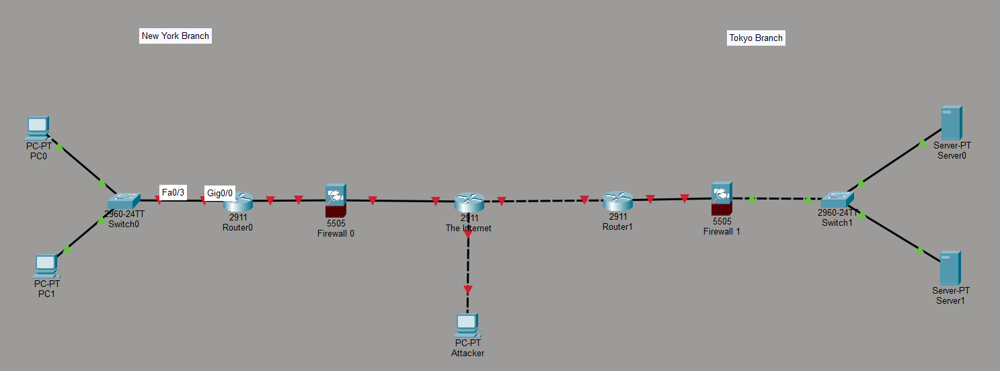

# Network Devices

## Objective

Create a simple network topology diagram representing a wide area network (WAN) while introducing Packet Tracer’s core functionalities.

## Materials

Cisco Packet Tracer

## Network Topology

## Configuration Summary

Since this is the first lab, the tasks presented were not especially complex. A network topology diagram of a WAN was setup, comprising of 2 LANs. Each LAN contains its own router, switch, and end devices. Each LAN is connected to the internet, as represented by the router in the middle. In this scenario, an external attacker is represented by a PC at the bottom of the diagram.

It is important to note the placement of the firewalls in each of the LANs. In the New York Branch, the firewall is placed between the Internet and the router. In the Tokyo Branch, the firewall is placed between the router and the switch. In doing so, Internet traffic passes through the firewall before reaching the router and entering the LAN. In contrast, in the Tokyo Branch, Internet traffic passes through the router first and is then filtered by the firewall before reaching the switch and the devices on the LAN. Assuming the router in the Tokyo Branch is configured to only expose its management interface to the LAN and not the internet, both LANs should have the same level of security. Placing the firewall between the switch and the router is more common with older hardware, as firewalls used to lack the sufficient routing capabilities to serve a network. Nowadays, firewalls have advanced enough to handle routing and filtering when acting as the ingress point into a network.

## Learning Outcomes

- Firewalls can be placed in front or behind a router, relative to the Internet.
